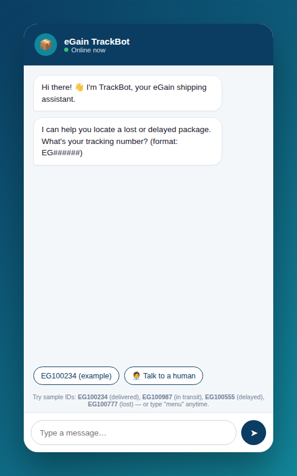
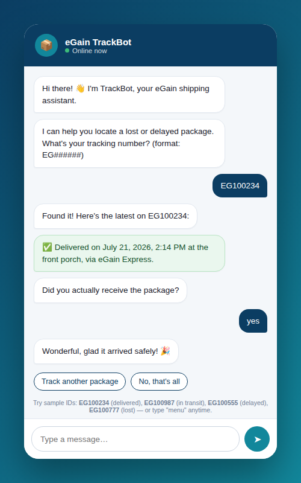
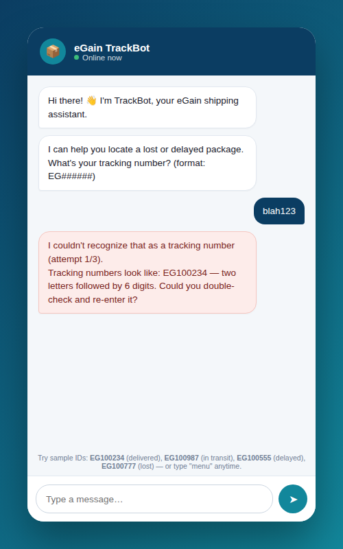
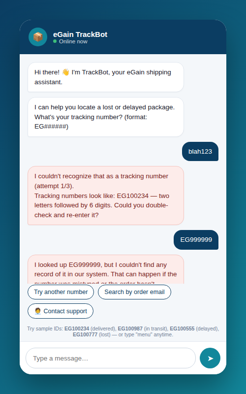

# eGain TrackBot — Lost Package Tracking Chatbot

A small, self-contained chatbot prototype that helps a customer track a lost or
delayed package.

## What's in this repo

| File | Purpose |
|---|---|
| `index.html` | The full chatbot prototype (HTML + CSS + JS, no build step, no dependencies) |
| `egain_trackbot_conversation_flow` | The conversation design / decision tree (open in a browser or image viewer) |
| `screenshots/` | Example conversations, including both error-handling paths |


## Setup / installation

No build tools, servers, or dependencies required.

1. Clone this repo:
   ```bash
   git clone https://github.com/jomothan/egain_customer_service_chatbot.git
   cd egain_customer_service_chatbot
   ```
2. Open `index.html` directly in your browser

That's it — it's a single static HTML file with inline CSS and vanilla
JavaScript (no npm install, no frameworks).

### Try it with these sample tracking numbers

| Tracking # | Status |
|---|---|
| `EG100234` | Delivered |
| `EG100987` | In transit |
| `EG100111` | Out for delivery |
| `EG100555` | Delayed |
| `EG100777` | Lost / exception |

Type `menu` at any time to restart, or `agent` to simulate escalating to a
human.

## My approach

I modeled the conversation as a small **finite-state machine**: `step` holds
the bot's current position in the tree (`ASK_TRACKING`, `NOT_FOUND_MENU`,
`DELIVERED_CONFIRM`, `ANYTHING_ELSE`, …), and each incoming user message is
parsed according to what that step expects. This keeps the logic readable —
one `switch` statement routes input to a handler function per node — instead
of a tangle of nested if/else across the whole file.

Design priorities, in order:

1. **Never dead-end.** Every state has a fallback response and quick-reply
   buttons, so a confused user is always shown a way forward rather than a
   wall of silence or a generic "I don't understand."
2. **Reduce typing, increase certainty.** Quick-reply buttons are offered
   wherever the next expected input is a small closed set (yes/no, menu
   choices), which is both faster for the user and avoids ambiguous free-text
   parsing.
3. **Branch by real-world shipment states**, not just "found / not found" —
   delivered, out for delivery, in transit, delayed, and lost/exception each
   get a distinct, appropriately-toned response (celebratory for delivered,
   apologetic for delayed/lost).
4. **Escalate gracefully.** A user can type "agent" / "human" at *any* point
   and get routed to a simulated human handoff — reflecting that a chatbot's
   job is to resolve what it can and get out of the way for what it can't.

## Error handling

Two required, plus one bonus, are implemented:

1. **Invalid tracking-number format** — if the input doesn't match
   `EG######`, the bot explains the expected format with an example, retries
   up to 3 times, and then offers to hand off to a human agent instead of
   looping forever.
2. **Valid format, but not found in the system** — the bot acknowledges the
   number looked correct, explains why this can still happen (typo /
   not-yet-shipped), and offers three explicit next steps: retry, look up by
   order email, or contact support.

## Technical implementation

- Plain HTML/CSS/JS — chosen so the reviewer can open one file with zero
  setup.
- Chat UI styled as a mobile messenger (bubbles, typing indicator, quick
  reply chips) to make the interaction feel like a real product surface, not
  a debug console.
- A `SHIPMENTS` object stands in for a shipment-tracking API/database.
- `botSay()` returns a Promise and awaits a short typing-indicator delay
  before rendering the message, so multi-message bot turns read naturally
  instead of dumping text instantly.

## Conversation design

See `flowchart.svg` for the full decision tree, including both required
error-handling branches and the four shipment-status branches. High-level
shape:

```
Greet → ask tracking #
  → invalid format → retry (max 3) → [fail] hand off to agent
  → valid format → look up shipment
      → not found → retry / search by email / contact support
      → found → branch by status
          → delivered → "did it arrive?" → yes / no (open case)
          → out for delivery / in transit → ETA + notify option
          → delayed → apology + new ETA
          → lost → apology + file claim / human agent
  → "anything else?" → yes (loop) / no (goodbye)

  [any state] unrecognized input → fallback + quick replies
  [any state] "agent"/"human" → escalate
  [any state] "menu"/"restart" → reset to start
```

## Screenshots

| Greeting & prompt | Successful lookup (delivered) |
|---|---|
|  |  |

| Error handling #1: invalid format | Error handling #2: not found |
|---|---|
|  |  |
